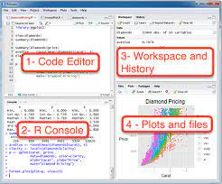
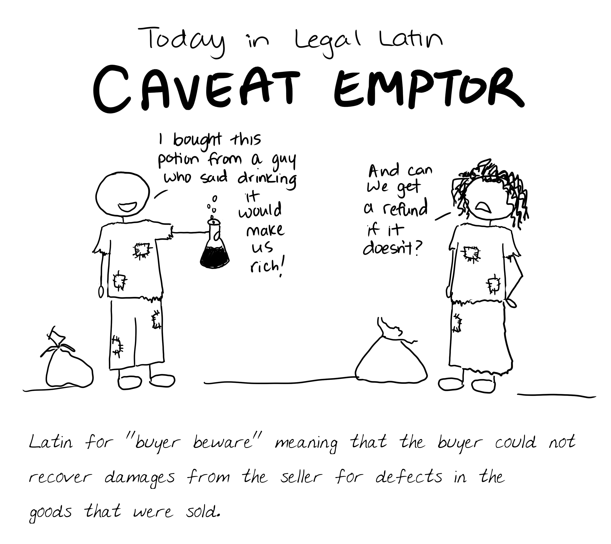
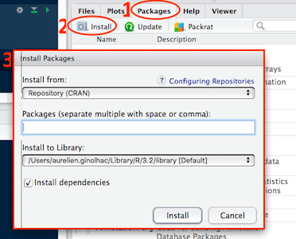
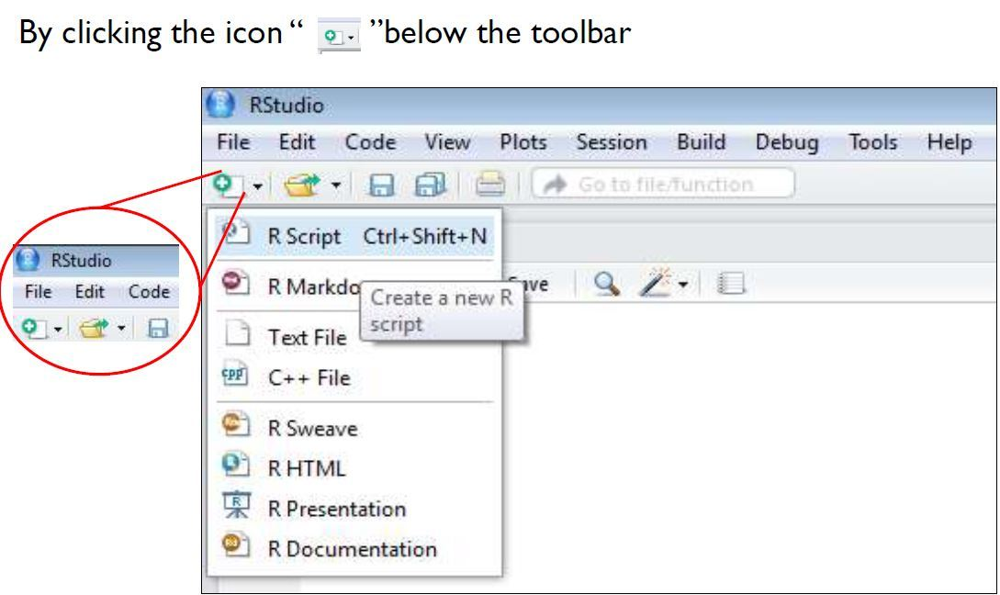
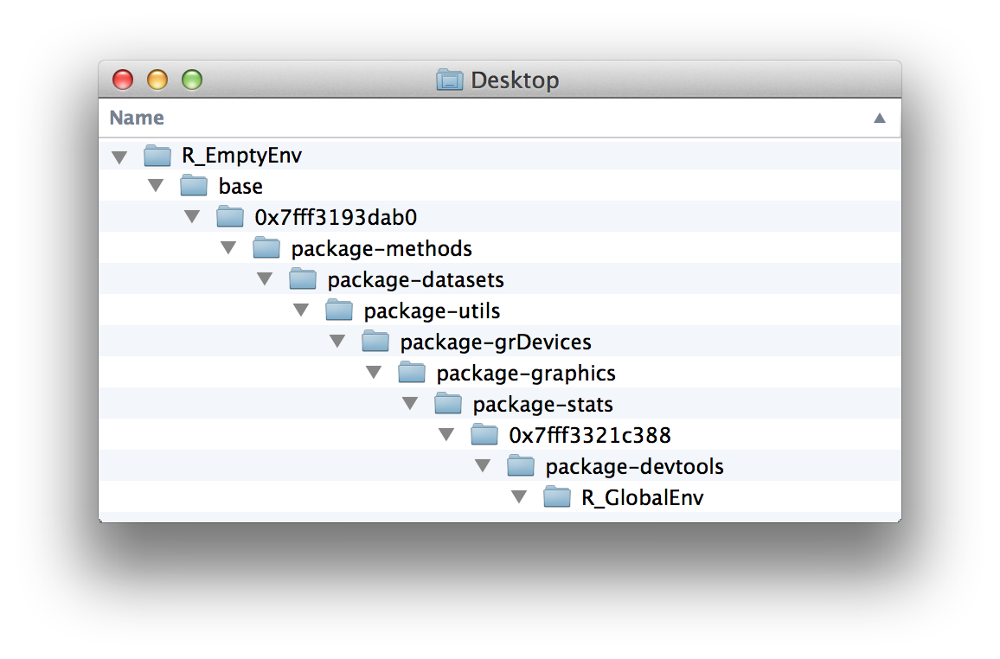

```{r setup, include=FALSE}
knitr::opts_chunk$set(echo = TRUE)
```

# Overview

This course will teach you how the basics of programming in R. Its purpose is to assist you with installing the required software including R and Rstudio as well as how to use these tools productively for your research goals.

## Installing required software and background

The course requires an installation of R version 4.2.1 and Rstudio.  You may install R and Rstudio directly from the following web sites:

* [R install](https://cran.r-project.org/)
* [R studio](https://www.rstudio.com/products/rstudio/)

Additional information on manual installation can be found [HERE](https://rstudio-education.github.io/hopr/starting.html#how-to-download-and-install-r)

Alternatively, if within the NIAID enterprise, you may install using self-service:

* [Windows Software Center](https://inside.niaid.nih.gov/it-equipment/installing-scientific-software-using-software-center)
* [Mac Self Service](https://inside.niaid.nih.gov/it-equipment/installing-scientific-software-mac-self-service)

#### Background

Throughout this tutorial, we will be using the following conventions.  Any example code we want you to try in the console, will be in gray box with the expected output in a box underneath as shown below:

```{r}
x <- 1
y <- 2

x + y
```

Each section of the course will be numbered for you to follow along with (e.g. 1, 2, 3, etc.).  We will work along interactively through each section and the instructor will be providing the context and background to each portion of the tutorial.

We use a project specific library through the [renv](https://rstudio.github.io/renv/index.html).  This means that all packages will only be installed and used in this specific R project.

## 1) What is R?

* Programming language focused on data manipulation, visualization, and analysis
* It is an implementation of the programming language S developed at Bell Laboratories by Rick Becker, John Chambers, and Allan Wilks
* It is supported by a robust community of researchers and developers that generate a variety of new functions through the use of packages that contain data and methods and can be found on [GitHub](https://github.com/qinwf/awesome-R) and the [Comprehensive R Archive Network (CRAN)](https://cran.r-project.org/)
* R can be used interactively directly from the command line but also through the use of an integrated development environment (IDE) of which Rstudio is frequently used and we will be using in this training


## 2) Using R interactively with Rstudio

* Open R studio and you will see the following:



* 2a) In the R console, let's try using R to do the classic Hello World!  programming exercise (see example code below)

```{r}
print("Hello world!")
```

* 2b) Let's try using using the `Workspace and History` panel to explore history of our commands, click on the `History` tab and you will see the previous command stored in your history.  You can even rerun it by highlighting and clicking on `To Console` button
* 2c) Let's store a variable

```{r}
x <- 1
x
```
* 2d) Now we can go back to the `Workspace and History` Panel again and click on `Environment` panel.  You should see a variable named `x` with a value of `1`.  **Interesting thing** about R is that it stores most variables as vectors and this just happens to be a numeric vector of length 1 having the value of 1
* 2e) Now let's check out the `Plots and Files` panel on lower right.  You can click each one to see information about the project we are working in, plotting, packages in the project library, help documentation, etc.
* 2f) Let's make a basic plot to see how it pops up in the `Plots` tab, run the following code in console

```{r}
# You can overwrite variables with new values, here we sample uniformly between 1 and 10
x <- runif(1000, 1.0, 10.0)
hist(x)
```

## 3) Installing R packages

R is a Free and Open Source (FOSS) programming language.  It is important to recall the old adage: "Buyer beware!".



Package quality varies and some important considerations on whether a particular package is trustworthy include some of the following considerations shown below.  A great example of a trustworthy package is [ggplot2](https://ggplot2.tidyverse.org/).  Please check out the package website and see if you can find examples of the following.

* Status of development life cycle showing a robust set of testing used to assess package functionality
* Amount of code used in the package that is covered by various tests
* Sharing of the package on CRAN which include a set of standard tests to assess package functionality
* Detailed documentation on what the package does, its functions, and how to use it
* A strong user base (we will check this by installing and using a package called cranlogs below)

**Install Packages**

* 3a) Now let's install our first R package to get some statistics on the number of downloads a particular R package has:

```{r eval=FALSE}
## The install.packages function is used to install new R packages via command line
## We will use it to install cranlogs that can tell us about how many times an R package is downloaded
install.packages("cranlogs")
```

* 3b) Let's use `cranlogs` package to determine how many downloads `ggplot2` package has

```{r}
## To load an R package, we use the library function
library(cranlogs)

## Lets see how many downloads ggplot2 had in 2021
ggplot2_dls <- cran_downloads(packages = "ggplot2", from = "2021-01-01", to = "2021-12-31")

# We can see that the average daily downloads of ggplot2 is over 70k!
mean(ggplot2_dls$count)
```

* 3c) R studio provides another way to install R packages via point and click method using the `Plots or Files` panel on lower right.  Let's use this method to install the `ggplot2` package.



## 4) Help and information on functions and packages

R includes a series of functions for providing the help documentation and other such information concerning packages and their related functions.

* 4a) Let's first try the help function to understand more about the help function itself

```{r}
help(help)
```

* 4b) Let's try on the `cran_downloads` function we used previously

```{r}
help("cran_downloads")
```

* 4c) Let's try the `?` command to search for information in an alternative way, this time to find information about ggplot2

```{r}
library(ggplot2)
?ggplot2
```
```{r}
# ?? allows for a search function for help and other documentation
??vector
```

## 5) Working with and executing commands from external files

R also allows you to execute commands from external files. Using such external files to save common commands or organize your code as the complexity increases is quite common.

* 5a) Let's try executing the "Hello world!" code we used before except doing so through and external file this time. We first need to create the file.



After doing so, please copy and paste the Hello World code below into the file and click the save button to save as `hello_word` in the main project folder under the scripts folder `scripts/hello_world.R` should be the final path.  This file should already be saved and you can overwrite it.

```{r eval=F}
print("Hello world!")
```

* 5b) let's now source and execute the Hello world file

```{r}
source("scripts/hello_world.R")
```

## 6) Examing the current list of variables, objects in your environment

As you create variables, functions in R, they get saved as objects in your working environment.  The lowest level is the Global Environment although certain objects during different parts of the analysis may get passed to other execution environments that are connected under the Global in a parent-child type relationship.  Another way to think about it is as a filesystem with directories and sub-directories.


In above example, the global environment is the lowest level environment, and if looking for an object it will first look in the lowest environment and then up the next level all the way up the tree.  If there is no object with a particular name, it will give an error.

* 6a) Let's take a look at the list of variables and objects currently within the global environment.

```{r}
# There are two ways of listing the current set of variables
objects()
ls()
```

* 6b) Let's delete the object `x`.  If looking in the `Environment` tab you should see the `x` variable be removed after running the code below.

```{r}
rm(x) # you can delete more than one object by passing a vector of objects such as rm(c(x,y))
```

## 7) R Data Types and more about objects

R contains a variety of base data types from which to use for your analyses.  We will go through the main data types in the next section.

* 7a) Vectors are created using `c` function and come in a variety of data types

```{r}
a <- c(1,2,5.3,6,-2,4) # numeric vector
b <- c("one","two","three") # character vector
c <- c(TRUE,TRUE,TRUE,FALSE,TRUE,FALSE) #logical vector
```

You can obtain specific elements within the vector by using subscripts

```{r}
a[1] # the first element
a[c(3,5)] # the third and fifth element
a[-1] # adding a minus sign removes the element
a[-c(3,5)] # without 3rd and 5th elements
```

* 7b) Matrices are created with `matrix` function and must contain the same data type.  It is essentially a 2d set of vectors of organized horizontally by rows and vertically by columns.

```{r}
# generates 5 x 4 numeric matrix
num_mat <-matrix(1:20, nrow=5,ncol=4)

# generates a 2 x 2 character matrix
chr_mat <- matrix(c("a", "a", "b", "b"), nrow = 2, ncol = 2) # by default, fills by column
```

You can obtain specific elements within the matrix in a similar way to vectors although now by using the dimensions

```{r}
num_mat[,4] # 4th column of matrix returned as vector
num_mat[3,] # 3rd row of matrix returned as vector
num_mat[1:2, 3:4] # rows 1 and 2 of columns 3 and 4 returned as matrix
```

* 7c) Arrays are multidimensional matrices.  We won't cover today but can be used for more advanced analyses.

```{r}
help(array)
```

* 7d) Data.frames are a generalized form of a matrix and the key difference is that data.frames allow for distinct data types within each column.

```{r}
mpg <- data.frame(mpg) # we will convert an example data set on automobiles to see how a data.frame functions

summary(mpg) # this is an excellent way to get a high level overview of a data.frame, you can see it consists of different types of data
```

There are multiple ways of obtaining columns of data

```{r eval=FALSE}
mpg[,1] # First column of data
mpg[,"manufacturer"] # First column of data this time obtained by its column name
mpg$manufacturer # Also can obtain using the dollar sign
```

Like matrices, data can be obtained using row and column information, three ways to get that info shown below.

```{r}
mpg[1:5, 1]
mpg[1:5, "manufacturer"]
mpg$manufacturer[1:5]
```

To get information about the data.frame

```{r}
colnames(mpg) # prints column names
rownames(mpg) # prints row names
dim(mpg) # the dimensions of the data.frame
head(mpg) # First few rows
tail(mpg) # Last few rows
summary(mpg) # overview of data.frame
str(mpg) # overview of data.frame
```

* 7e) Lists are created using `list` function and provide a way of storing different types under a single name. Let's try it using some of the previous data we generated.

```{r}
l <- list(mychars = c("Mary", "Jane"), mydfs = list(mpg, ggplot2_dls), mynums = a, mymatrix = num_mat, mylogical = c)
```

```{r}
l[[1]] # Elements within list can be identified using the index
l[["mychars"]] # Also by the name of the element
head(l[[2]][[1]]) # For lists of list, you can identify similarly by sub-indexes, here we look at first few rows of one of the data.frames in the second element of the list, a list of data.frames
```

* 7f) Factors are a way to make a nominal or categorical variable and are created using the `factor` function

```{r}
# variable gender with a yes or no response
response <- c(rep("yes",20), rep("no", 30))
response <- factor(response)
response
```

These can also be ordered such that each level has an ordering (e.g. ratings or categorical rankings with inherent ordering between levels)

```{r}
response <- ordered(response)
response
```

## 8) Basic data manipulations

* 8a) Let's do some basic arithmetic on vectors in R to see how it works

```{r}
v <- c(1,2,3,4,5)

v + 1 # additions are vectorized

v / v # if vectors of same length are analyzed then it is vectorized across both vectors

v * v
```

* 8b) some common functions for analyzing vectors

```{r}
mean(v) # average
sd(v) # standard deviation
sum(v) # summation
```

* 8c) editing data in place

```{r}
v

v[3] <- -3

v
```

* 8d) Sequence generation

```{r}
s <- seq(1,10, by = 0.5)

s

s2 <- seq(-1, -10, by = -0.5)

s2
```

* 8e) Missing data

```{r}
v[3] <- as.numeric(NA)

v # missing data is often represented by NA

is.na(v) # This function can tell you which elements are NA

v[is.na(v)] <- -3 # you can use this to replace missing values as needed

v
```

## 9) Functions

Function are created in R using the `function` function.  It allows you to specific the input variables along with a small snippet of code that performs a task, preferably something that will be used more than once.  By encapsulating this code, it keeps it in one place and makes it easier to make changes, or fix issues should any arise.

9a) Let's create a function in R that finds the exponential of a particular number

```{r}
# We create a simple function that takes a number x and an exponential to give the exponential of the number x
exponentiate <- function(x, exponential){
  x^exponential
}

# The cool thing about functions are that they are vectorized
v

exponentiate(x = v, 2) # Let's exponentiate the vector v to the power of 2
```

You will notice that the function gets saved to your environment in the `Environment` tab.  At this point, you will observe data consisting of matrices, data.frames, list.  Values consisting of vectors or other data.types that are vectorized.  Lastly, you will observe functions including `exponentiate` describing the input variables required.

## 10) Grouping, looping, and conditional executions

During your analysis, you may wish to group items for analysis, loop through data, and conditionally execute code.  It is possible to do this; however, whenever available it is faster to do a vectorized analysis.  We shall examine both approaches below.

* 10a) Grouping data in R can be performed with the `subset` function which can take a logical expression, let's first explore logical expressions available in R

```{r}
1 < 2 # less than
1 <= 2 # less than or equal to
1 > 2 # greater than
1 >= 2 # Greater than or equal to
1 == 2 # equal to
1 != 2 # not equal to

TRUE && FALSE # AND operator meaning both have to be true
TRUE || FALSE # OR operator meaning either have to be true

c(TRUE, TRUE) & c(TRUE, FALSE) # vectorized AND
c(TRUE, TRUE) | c(TRUE, FALSE) # vectorized OR
```
We can use the above operators to filter, group or subset data as needed.

```{r}
subset(mpg, manufacturer == "audi") # Let's select group of records that are manufacturer by Audi

subset(mpg, manufacturer == "audi" & hwy > 30) # Let's look at Audi cars with highway mileage greater than 30
```

* 10b) We can also use the `aggregate` function to do some simple grouping analysis on our data, let's try it to get the mean highway mpg by manufacturer, we use a `formula` to specify the aggregation we are interested in

```{r}
aggregate(hwy ~ manufacturer, data = mpg, mean)
```

* 10c) We can also perform looping using traditional programming approach as opposed to vectorization although the latter is always preferred in R.

```{r}
# Let's loop through the vector v and print out each element
for (e in v){
  print(e)
}
```

* 10d) we can also perform conditional programming based upon our looping, let's only print out if the number is negative and then print a message if it is not negative

```{r}
for (e in v){
  if(e < 0){
    print(e)
  }else{
    print("Not negative")
  }
}
```

A particularly handy condition function is the `ifelse` function.  Let's check out its functionality below.

```{r}
v
ifelse(v < 0, yes = "yes", no = "no")
ifelse(v < 0, yes = T, no = F)
```

## 11) Reading and writing data

Ultimately, the goal of using R is to get into analyzing your own data.  We will take a look at how to read and write data using R.

* 11a) Let's first take our mpg practice data.frame and learn how to save it to a file using the `write.csv` function.  We will write the data to the `output` folder and save with a file name called `mpg.csv`.

```{r}
write.csv(x = mpg, file = "output/mpg.csv", row.names = F) # If you do not specify row.names = F then the row names will be written out, there are other function inputs you can look up using help(write.csv)

list.files("output") # Let's check that our data was written out to the correct folder by listing out the files in the folder
```

* 11b) Now let's try reading the data back into R from the saved file with `read.csv` function.

```{r}
mpg_from_file <- read.csv(file = "output/mpg.csv", header = T) # header parameter can be True if the file contains a header such as colnames or False if the data starts on row 1

all(mpg == mpg_from_file) # we will check that the data from the file is equal to the original data we saved
```

## Next steps

Today you have learned a lot about how to manipulate and work with data using the R programming language.  Hopefully this will help you get started with analyzing your own data!  Nonetheless, this is just the beginning of your journey into data science with R.  Below you will see some recommended resources to follow up with to continue learning.

* [Intro to R](https://cran.r-project.org/doc/manuals/r-release/R-intro.pdf)
* [Coursera Data Science Specialization](https://www.coursera.org/specializations/jhu-data-science)
* [R for Data Science Book](https://r4ds.had.co.nz/index.html)
* List and resources of useful R packages:
  + [Rstudio's recommendations](https://support.rstudio.com/hc/en-us/articles/201057987-Quick-list-of-useful-R-packages)
  + [Computerworld list](https://www.computerworld.com/article/2921176/great-r-packages-for-data-import-wrangling-visualization.html)
  + [Awesome R GitHub list](https://github.com/qinwf/awesome-R)
  + [CRAN Package Topics](https://cran.r-project.org/web/views/)
  + [Bioconductor for bioinformatics R packages](https://www.bioconductor.org/)


