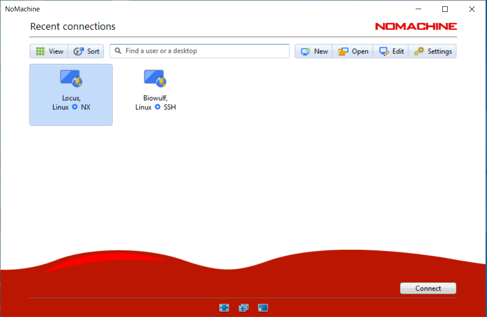

```{r setup, include=FALSE}
knitr::opts_chunk$set(echo = TRUE)
```

# Overview

This course will teach you the basics of setting up a scalable targets workflow project in R on a high-performance computing environment. Its purpose is to assist you with understanding how setting up the workflow can improve your analyses, lead to more reproducible research, and make it easier to collaborate especially with other data scientists.

We assume a familiarity with R (intermediate level or greater), functional programming, HPC, workflows, and data science.

## Installing required software and background

This workshop relies on access to NIAID Locus HPC infrastructure and ability to connect to Locus via interactive sessions using No Machine  The No Machine software is required to be installed on your local computer as well as internet connection with VPN access for stable interactive session with Locus.  Please see below for installation and set up of No Machine and access to VPN which needs to be done ahead of the workshop!  If not, then it will not be possible to fully participate although possible to observe and learn from the demo provided in the workshop.

* [Requesting VPN Access](https://inside.niaid.nih.gov/it-equipment/vpn)
* [No Machine Installation](https://www.nomachine.com/)
* [Requesting No Machine Credentials and setting up connection to Locus](https://hpcweb.niaid.nih.gov/userportal/documentation.php#FAQ/the-nomachine-terminal-server)

Once you can run the xeyes example in the second bullet, you should be set up for the workshop.

#### Background

Throughout this tutorial, we will be using the following conventions.  Any example code we want you to try in the console, will be in gray box with the expected output in a box underneath as shown below:

```{r}
x <- 1
y <- 2

x + y
```

Each section of the course will be numbered for you to follow along with (e.g. 1, 2, 3, etc.).  We will work along interactively through each section and the instructor will be providing the context and background to each portion of the tutorial.

We use a project specific library through the [renv](https://rstudio.github.io/renv/index.html) package.  This means that all packages will only be installed and used in this specific R project.  The approach of using `renv` aids in reproducibility since you can keep the set of R packages related to the particular project in the same location for others to install and use.

## 1) What is targets?


## 2) Why use targets?

We will follow along on a tutorial provided by the package's author Will Landau to explain the benefits of using reproducible pipelines and specifically targets when doing analyses primarily using R although targets can be used with python code as well via the `reticulate` R package.

All slides can be found at [https://wlandau.github.io/targets-tutorial/#1](https://wlandau.github.io/targets-tutorial/#1)

## 3) tflow to set up targets project workflows


Each time you set up a new analysis, create a new R project in Rstudio with renv local project repository (to keep track of version of R packages and R you are using).

After setting up the project, execute the following code to set up the project as a targets workflow using tflow opinionated set up.  Will build up consistency in developing your analyses and also includes a few benefits such as checking for conflicts between R packages and incorrect logical tests. For example, `dplyr::filter` and `stats::filter`.

```{r eval=F}
# First install remotes
install.packages("remotes")

# Next install tflow with dependencies (adds targets, tarchetypes, fnmate, and more)
remotes::install_github("MilesMcBain/tflow", dependencies = T)

# Activate tflow project structure
tflow::use_tflow()

# Add .gitignore file with files to ignore should you use github (yes, you should be using!)
tflow::use_gitignore()

# Install usethis to add git to local project
install.packages("usethis")

# Add git to project
usethis::use_git()

# Then restart your project and make initial commit

```

#### 3a) Tflow project structure


* Add the packages you need to the `packages.R` file making sure to first `install.packages("package_name")` in local renv folder and then adding a line `library("package_name")` in `packages.R` file.
* Add targets workflow steps in the `_targets.R` file
* Add additional folders (e.g. data, output, etc.) in the project as needed using `usethis::use_directory()` to ensure full reproducibility, which can be done as part of the analysis
* Consider encapsulating all aspects of the workflow as function calls using `fnmate` addins `Create function definition file` which will add the function along with input arguments in the R folder within the project so `_targets.R` will load the functions when executing pipeline with `targets::tar_make()`


## 4) Setting up a targets workflow with tflow on NIAID Locus HPC

#### 4a) Connect to NIAID Locus via NoMachine

See [instructions](https://hpcweb.niaid.nih.gov/userportal/documentation.php#FAQ/the-nomachine-terminal-server) for connecting to Locus via NoMachine.




#### 4b) Create an interactive session through NoMachine and start Rstudio on Locus

* Open terminal and request resources for an interactive session


* Request R and Rstudio modules and start interactive Rstudio session


#### 4c) Install required packages into the renv local project folder

Follow example above to create the new tflow targets workflow project from Rstudio and name it `tflow_hpc_tutorial`.  We will use it to reproduce the example shown in this tutorial from scratch.

```{r eval=F}
# First install remotes
install.packages("remotes")

# Next install tflow with dependencies (adds targets, tarchetypes, fnmate, and more)
remotes::install_github("MilesMcBain/tflow", dependencies = T)

# Activate tflow project structure
tflow::use_tflow()

# We skip git related set up for today's exercise but please consider using for your analyses

```

#### 4d) Install required packages into the renv local project folder

```{r eval=F}
install.packages("rentrez")
install.packages("tidyverse")
install.packages("future")
install.packages("future.batchtools")
install.packages("batchtools")
install.packages("reticulate")
install.packages("qs") # We don't load this but it is needed to saving/loading of the targets objects in faster format
install.packages("tensorflow") # We need this for later AI/DL target
install.packages("keras") # We need this for later AI/DL target
```

#### 4e) Add required libraries to `packages.R` file. Adding the lines below to the file and saving.

```{r eval=F}
library(future)
library(future.batchtools)
library(batchtools)
library(reticulate)
library(tidyverse)
```

#### 4f) Create template batchtools file `sge.tmpl` in your project folder and add the following code to the file to tell targets how to parallelize the workflow over the HPC cluster.

To scale up our computation across the available HPC compute resources, we will be using the `future`, `batchtools`, `future.batchtools` R packages with the interface that targets provides for initiating a workflow `tar_make_future(workers = number of requests to simultaneously send to HPC)`.

`future` provides a unified interface for working with batchtools.  More information about [future](https://future.futureverse.org/), [batchtools](https://mllg.github.io/batchtools/index.html), and the way targets supports [scalable HPC computation]() are found in each link.

Before we can initiate the request we need to set up a template file that tells batchtools what resources we will need as part of each independent request.  This file needs to be placed in your main project folder and you can name it `sge.tmpl`.

The following code (see below) should be added to the `sge.tmpl` template file and will tell `batchtools` backend how to distribute computation across the Locus HPC for all the targets that are run in this workflow.  It will use the provided resource request for each target such as `ncpus`, `ngpus` to specify the required resources in each queued request.  It will default to requesting 10 cpus with 10GB of memory for each cpu in absence of any specific resource amount.

It will also load cuDNN/CUDA for AI/DL and R/Rstudio for each request.  You could add other modules or tools or commands as needed for other projects by modifying the template file.

The template file is adapted to Locus HPC from [source](https://github.com/mllg/batchtools/blob/master/inst/templates/sge-simple.tmpl).  Other HPC systems may require different template files.

```{r eval=F}
#!/bin/bash

## The number of cores
<%= if (!is.null(resources$ncpus)) sprintf(paste0("#$ -pe threaded ", resources$ncpus)) else "#$ -pe threaded 10" %>

## The memory requested. Max should be under 240G across all cpus.
<%= if (!is.null(resources$memory)) sprintf(paste0("#$ -l h_vmem=", resources$memory)) else "#$ -l h_vmem=10G" %>

## Any GPU requested
<%= if (!is.null(resources$ngpus)) sprintf(paste0("#$ -l gpu=", resources$ngpus)) %>

## The name of the job, can be anything, simply used when displaying the list of running jobs
#$ -N <%= job.name %>

## Combining output/error messages into one file
#$ -j y

## Giving the name of the output log file
#$ -o <%= log.file %>

## One needs to tell the queue system to use the current directory as the working directory
## Or else the script may fail as it will execute in your top level home directory /home/username
#$ -cwd

## Use environment variables
#$ -V

## Export value of DEBUGME environment var to slave
export DEBUGME=<%= Sys.getenv("DEBUGME") %>

module load cudnn/8.1.1.33-CUDA-10.2.89 rstudio/1.4.1717-R-4.1.0

<%= sprintf("export OMP_NUM_THREADS=%i", resources$omp.threads) -%>
<%= sprintf("export OPENBLAS_NUM_THREADS=%i", resources$blas.threads) -%>
<%= sprintf("export MKL_NUM_THREADS=%i", resources$blas.threads) -%>

Rscript -e 'batchtools::doJobCollection("<%= uri %>")'
exit 0
```

#### 4g) Add required code to the beginning of `_targets.R` file to specify use of batchtools with future and tell the workflow what template to use.

Ensure that the code below is added to the `_targets.R` file.  This will ensure that targets loads the required packages and specifies the use of batchtools with the correct template with future.  It also sets up use of `qs` for faster saving/loading of targets from workflow as well as default resource request of 4G of memory.  We use the `tweak` function to adjust our resource requests on the fly for any target, which we will see later.  Tweak modifies the template we provide if certain targets require more or less compute resources.

*Important:* Please check the compute limits on each node to ensure that you do not request more resources than a node can handle or that a specific user is allotted. You can always refer to Locus website for more information.

```{r eval=F}
## Load your packages, e.g. library(targets).
source("./packages.R")

plan(batchtools_sge, template = "sge.tmpl")

tar_option_set(format = "qs", 
               resources = tar_resources(
                 qs = tar_resources_qs(preset = "fast"),
                 future = tar_resources_future(plan = tweak(
                   batchtools_sge,
                   template = "sge.tmpl",
                   resources = list(
                     memory = "4G"
                   )))))

## Load your R files
lapply(list.files("./R", full.names = TRUE), source)

tar_plan(
  
)
```

#### 4h) Add first target to the `_targets.R` file which will set up a local conda environment for this project

A nice thing about targets and the use project-specific folders is that you can specify the presence of certain files before any downstream targets are run. We will use this functionality, more details [here](https://books.ropensci.org/targets/data.html#external-files), to set up a custom conda environment with its own libraries and software.  You can learn more about conda [here](https://docs.conda.io/en/latest/)

Using conda is helpful for reproducibility.  To use it with R, we will use the `reticulate` package to install a minimal version of conda first and then use that to install our specific required libraries and packages into a project environment.

Before doing that we specify a target where the output will be the files produced by the conda installation.  We also request only a single GPU with default memory.  We will not need significant compute resources; we will need the GPU to ensure that certain libraries requiring GPU are installed correctly.  The name of the target will be `conda_env` and we will create an R function called `setup_conda_env` to do the required set up within our `tar_plan`.

```{r eval=FALSE}
  tar_target(name = conda_env,
             command = setup_conda_env(),
             format = "file",
             resources = tar_resources(
               future = tar_resources_future(plan = tweak(
                 batchtools_sge,
                 template = "sge.tmpl",
                 resources = list(
                   ngpus = 1
                 )))))
```

#### 4i) Add required code to  `R/setup_conda_env.R` file

Adding this code to the file will tell the workflow what the `setup_conda_env` function should do.  In this case, create a new project folder called `miniconda` if it doesn't already exist and then install miniconda as well as create an environment called tensorflow with GPU version of tensorflow and keras. Finally, return the file paths of miniconda environment to let workflow know they have been installed.

```{r eval=FALSE}
#' .. content for \description{} (no empty lines) ..
#'
#' .. content for \details{} ..
#'
#' @title

setup_conda_env <- function() {
  
  if(!dir.exists("miniconda")){
    install_miniconda(path = "miniconda")
    
    conda_create(envname = "./miniconda/envs/tensorflow", forge = T, conda = "./miniconda/condabin/conda", python_version = "3.7", packages = c("tensorflow-gpu", "keras-gpu"))
    
    use_condaenv(condaenv = "./miniconda/envs/tensorflow/", conda = "./miniconda/condabin/conda")
    use_python(python = "./miniconda/envs/tensorflow/bin/python3.7m")
    
  }

  list.files("./miniconda/envs/tensorflow", full.names = T)
  
}
```

#### 4j) Run `tar_make_future(workers = 4)`

Initial conda install and set up may take ~5+ minutes especially if the request is sitting in a queue waiting for required resources to free up. However, once completed then you will have the required tensorflow and keras install to do the next part of the workflow.

#### 4k) Add target to produce our tutorial dataset to `_targets.R` file

In our next target, our goal is to create a training and test dataset using a publicly-shared [heart disease dataset](https://tensorflow.rstudio.com/reference/tfdatasets/hearts/).  

Now that we have created the conda environment with tensorflow and keras, we will create downstream targets that use these resources. To make sure that these targets are aware of the conda environment, we will provide the name of the target that lists the names of the environment files within the code or in function call associated with the target. In our case, we create a function called `make_keras_data(conda_env)` that takes the target name for the conda env as function argument and then will perform the part of the analysis to achieve above objective of creating the tutorial dataset.


```{r eval=F}
  tar_target(name = keras_data,
             command = make_keras_data(conda_env),
             resources = tar_resources(
               future = tar_resources_future(plan = tweak(
                 batchtools_sge,
                 template = "sge.tmpl",
                 resources = list(
                   ngpus = 1
                 )))))
```


#### 4l) Add required code to  `R/make_keras_data.R` file

Adding this code to the file will tell the workflow what the `make_keras_data` function should do.  Here we 1) specify to use the python binaries and conda environment we created earlier, 2) load `tfdatasets` package which contains the hearts dataset and load into our local environment, 3) create a train/test split of the dataset, and 4) return the training and test datasets as a list for later use.

```{r eval=FALSE}
#' .. content for \description{} (no empty lines) ..
#'  Modified from https://tensorflow.rstudio.com/guide/tfdatasets/feature_spec/
#' .. content for \details{} ..
#'
#' @title
#' @param conda_env
make_keras_data <- function(conda_env) {
  
  use_python(python = "miniconda/envs/tensorflow/bin/python3.7m")
  use_condaenv(condaenv = "./miniconda/envs/tensorflow/", conda = "./miniconda/condabin/conda")
  
  library(tfdatasets)
  
  #Load dataset example (heart attack risk) in our local environment
  data(hearts)
  
  #Split into train and test set
  set.seed(-10)
  ids_train <- sample.int(nrow(hearts), size = 0.75*nrow(hearts))
  hearts_train <- hearts[ids_train,]
  hearts_test <- hearts[-ids_train,]
  
  return(list("train" = hearts_train,
              "test" = hearts_test))
  
}
```

#### 4m) Run `tar_make_future(workers = 4)`

The workflow should run again but skip the conda environment target and execute the code to create the train and test datasets.

#### 4n) Add target to perform the keras neural network modeling to the `_targets.R` fille

Add the required target that will save the neural network modeling.  Here we specify a keras format for the return.  We don't have a large network to train so we only need 1 GPU, 4 cores, and 32GB of memory in total.  Recall that memory is 8GB per core.  For this target, we create a `make_hearts_model(keras_data)` function that takes in the train and testdataset target name as the function input.  This will tell targets that we need the upstream data before the modeling should be run.

```{r eval=FALSE}
  tar_target(name = hearts_keras_model,
             command = make_hearts_model(keras_data),
             format = "tensorflow",
             resources = tar_resources(
               future = tar_resources_future(plan = tweak(
                 batchtools_sge,
                 template = "sge.tmpl",
                 resources = list(
                   ngpus = 1,
                   cpus = 4,
                   memory = "8G"
                 )))))
```

#### 4o) Add required code to the `R\make_hearts_model.R` file.

Add the required code to the `R\make_hearts_model.R` file to provide instructions to the `make_heart_model` function. The code was adapted from [link](https://tensorflow.rstudio.com/tutorials/advanced/structured/classify/). Recall that the function takes in an upstream target named `keras_data` which contains the list of training and testing data.  The code will do the following: 1) Load training and testing data, 2) wrangle data, 3) pre-process/transform, 4) create a simple neural network, 5) train the network and return the trained model.

```{r eval=FALSE}
#' .. content for \description{} (no empty lines) ..
#'
#' .. content for \details{} ..
#'
#' @title
#' @param keras_data
make_hearts_model <- function(keras_data) {

  library(tensorflow)
  library(keras)
  library(tfdatasets)

  # We scale all numeric columns initially due to bug mentioned with
  # normalizer_fn
  hearts_train <- keras_data$train %>%
    mutate(across(where(is.numeric) & !c(age, target), ~scale(.x)))
  hearts_test <- keras_data$test %>%
    mutate(across(where(is.numeric) & !c(age, target), ~scale(.x)))
  
  #Data wrangling specifications - standard mean subtraction and
  #variance normalization on all numeric columns except a few
  #that need other processing, to avoid bug with normalizer_fn we do scaling first before setting up
  # wrangling specifications...left the commented code to see how it could be done only via step_numeric_column
  spec <- feature_spec(hearts_train, target ~ .)
  spec <- spec %>% 
    step_numeric_column(
      all_numeric(), -cp, -restecg, -exang, -sex, -fbs
      # normalizer_fn = scaler_standard() # Bug prevents model from saving during serialization (see https://github.com/rstudio/tfdatasets/pull/82)
    ) %>%
    # Set up categorical column using thal column
    step_categorical_column_with_vocabulary_list(thal)
  
  # Change age into buckets of age groups
  spec <- spec %>% 
    step_bucketized_column(age, boundaries = c(18, 25, 30, 35, 40, 45, 50, 55, 60, 65))
  
  # Change categorical to numeric representation as an embedding layer
  spec <- spec %>% 
    step_indicator_column(thal) %>% 
    step_embedding_column(thal, dimension = 2)
  
  # Add interaction between tha1 and age
  spec <- spec %>% 
    step_crossed_column(thal_and_age = c(thal, bucketized_age), hash_bucket_size = 1000) %>% 
    step_indicator_column(thal_and_age)
  
  # Fit the data wranging steps
  spec_prep <- fit(spec)
  
  # Set up the model to use the wrangled data to predict
  # target column (diagnosis of heart disease angiographic)
  # we will use Adam with binary crossentropy for optimization
  # on accuracy of prediction
  input <- layer_input_from_dataset(hearts_train %>% select(-target))
  
  output <- input %>% 
    layer_dense_features(dense_features(spec_prep)) %>% 
    layer_dense(units = 32, activation = "relu") %>% 
    layer_dense(units = 1, activation = "sigmoid")
  
  model <- keras_model(input, output)
  
  model %>% compile(
    loss = loss_binary_crossentropy, 
    optimizer = "adam", 
    metrics = "binary_accuracy"
  )
  
  model %>%
    fit(x = hearts_train %>% select(-target),
        y = hearts_train$target,
        epochs = 15,
        validation_split = 0.2)
  
  model

}
```

#### 4p) Run `tar_make_future(workers = 4)`

The workflow should run again but skip the upstream steps like conda environment, data set creation and train/test split.  

