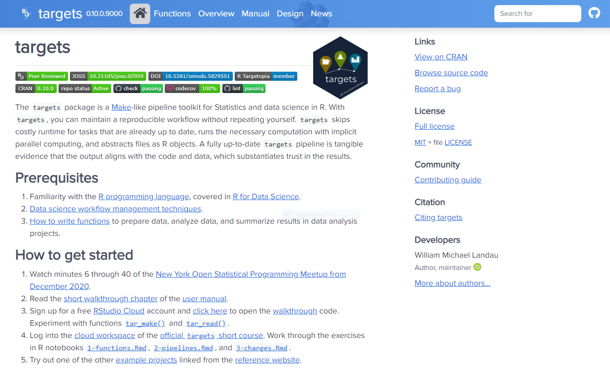
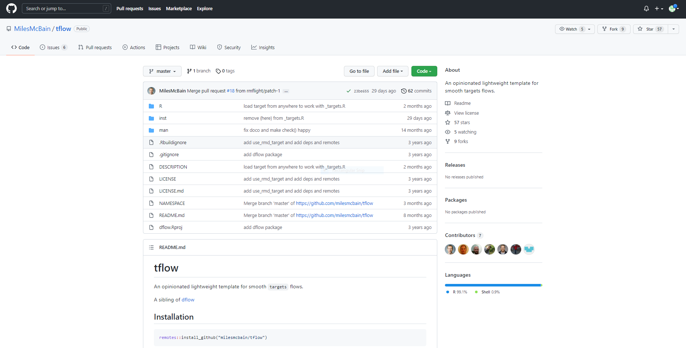
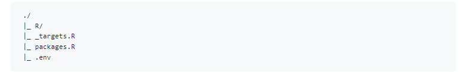
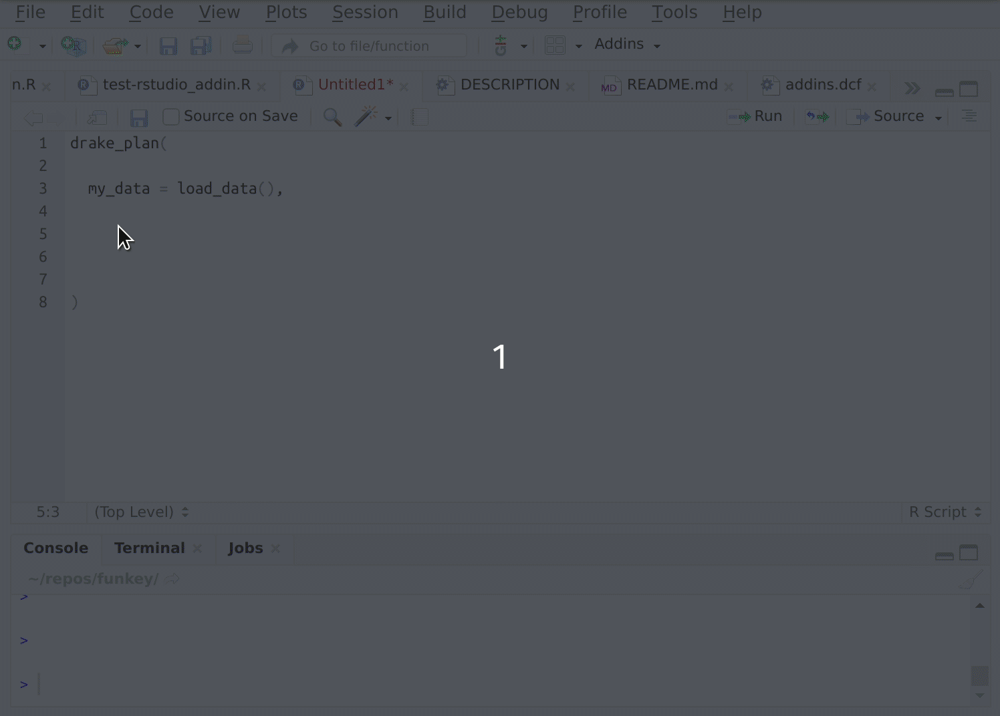

```{r setup, include=FALSE}
knitr::opts_chunk$set(echo = TRUE)
```

# Overview

This course will teach you the basics of setting up a targets workflow project in R. Its purpose is to assist you with understanding how setting up the workflow can improve your analyses, lead to more reproducible research, and make it easier to collaborate especially with other data scientists.

We assume a familiarity with R, functional programming, and data science.

## Installing required software and background

TThe course requires an installation of R version 4.2.1 and Rstudio.  You may install R and Rstudio directly from the following web sites:

* [R install](https://cran.r-project.org/)
* [R studio](https://www.rstudio.com/products/rstudio/)

Additional information on manual installation can be found [HERE](https://rstudio-education.github.io/hopr/starting.html#how-to-download-and-install-r)

Alternatively, if within the NIAID enterprise, you may install using self-service:

* [Windows Software Center](https://inside.niaid.nih.gov/it-equipment/installing-scientific-software-using-software-center)
* [Mac Self Service](https://inside.niaid.nih.gov/it-equipment/installing-scientific-software-mac-self-service)

#### Background

Throughout this tutorial, we will be using the following conventions.  Any example code we want you to try in the console, will be in gray box with the expected output in a box underneath as shown below:

```{r}
x <- 1
y <- 2

x + y
```

Each section of the course will be numbered for you to follow along with (e.g. 1, 2, 3, etc.).  We will work along interactively through each section and the instructor will be providing the context and background to each portion of the tutorial.

We use a project specific library through the [renv](https://rstudio.github.io/renv/index.html) package.  This means that all packages will only be installed and used in this specific R project.  The approach of using `renv` aids in reproducibility since you can keep the set of R packages related to the particular project in the same location for others to install and use.

## 1) What is targets?



## 2) Why use targets?

We will follow along on a tutorial provided by the package's author Will Landau to explain the benefits of using reproducible pipelines and specifically targets when doing analyses primarily using R although targets can be used with python code as well via the `reticulate` R package.

All slides can be found at [https://wlandau.github.io/targets-tutorial/#1](https://wlandau.github.io/targets-tutorial/#1)

## 3) tflow to set up targets project workflows




Each time you set up a new analysis, create a new R project in Rstudio with renv local project repository (to keep track of version of R packages and R you are using).

After setting up the project, execute the following code to set up the project as a targets workflow using tflow opinionated set up.  Will build up consistency in developing your analyses and also includes a few benefits such as checking for conflicts between R packages and incorrect logical tests. For example, `dplyr::filter` and `stats::filter`.

```{r eval=F}
# First install remotes
install.packages("remotes")

# Next install tflow with dependencies (adds targets, tarchetypes, fnmate, and more)
remotes::install_github("MilesMcBain/tflow", dependencies = T)

# Activate tflow project structure
tflow::use_tflow()

# Add .gitignore file with files to ignore should you use github (yes, you should be using!)
tflow::use_gitignore()

# Install usethis to add git to local project
install.packages("usethis")

# Add git to project
usethis::use_git()

# Then restart your project and make initial commit

```

#### 3a) Tflow project structure




* Add the packages you need to the `packages.R` file making sure to first `install.packages("package_name")` in local renv folder and then adding a line `library("package_name")` in `packages.R` file.
* Add targets workflow steps in the `_targets.R` file
* Add additional folders (e.g. data, output, etc.) in the project as needed using `usethis::use_directory()` to ensure full reproducibility, which can be done as part of the analysis
* Consider encapsulating all aspects of the workflow as function calls using `fnmate` addins `Create function definition file` which will add the function along with input arguments in the R folder within the project so `_targets.R` will load the functions when executing pipeline with `targets::tar_make()`



## 4) Setting up a targets workflow with tflow

Follow example above to create the new tflow targets workflow project from Rstudio and name it `tflow_tutorial`.  We will use it to reproduce the example shown in this tutorial from scratch.

```{r eval=F}
# First install remotes
install.packages("remotes")

# Next install tflow with dependencies (adds targets, tarchetypes, fnmate, and more)
remotes::install_github("MilesMcBain/tflow", dependencies = T)

# Activate tflow project structure
tflow::use_tflow()

# We skip git related set up for today's exercise but please consider using for your analyses

```

#### 4a) Install required packages into the renv local project folder

```{r eval=F}
if (!require("BiocManager", quietly = TRUE))
  install.packages("BiocManager")

install.packages("rentrez")
install.packages("tidyverse")
install.packages("usethis")
install.packages("ape")
BiocManager::install("msa")
BiocManager::install("ggtree")
```

#### 4b) Add required libraries to `packages.R` file. Adding the lines below to the file and saving.

```{r eval=F}
library(rentrez)
library(tidyverse)
library(usethis)
library(ape)
library(msa)
library(ggtree)
```

#### 4c) Add the first target to the `_targets.R` file.  Adding the lines below to the file within the `tar_plan` function call and saving.

```{r eval=F}
tar_target(entrez_db_summaries, make_db_summaries())
```

After adding lines, move cursor to the parenthesis of `make_db_summaries()` function and click on Addins `Create function definition file` under fnmate section.  This will add the function to R folder.

#### 4d) Add the code to do the initial db summaries.  Adding the lines below to the file `make_db_summaries.R` within the function call and saving.

```{r eval=F}
# List entrez dbs available
dbs <- entrez_dbs()

# Provides a summary of each database for our records
db_summaries <- map(dbs, ~entrez_db_summary(.x))

# Names each element of the list with the db name
names(db_summaries) <- dbs

# Last line provides the list as the return object of the function...this will be the object saved in the targets workflow step
db_summaries

```

#### 4e) Execute `targets::tar_make()` to run the pipeline.

```{r eval=F}
targets::tar_make()
```

#### 4f) Add the code to write pop set to an external file.  Adding the lines below to the file `_targets.R` and saving.

```{r eval=F}
tar_target(entrez_db_summaries, make_db_summaries()),

tar_target(pop_set_file, write_pop_set(entrez_db_summaries), format = "file")
```

#### 4g) Add the code to perform the write pop set analysis in `write_pop_set.R` file.  adding the lines below to the file within the function call and saving.

```{r eval=F}

#Since we are saving output, we need to create a folder to save the data to using usethis, we won't create again if already there
if(!dir.exists("output/fasta")){
  use_directory("output/fasta")
}

#Search for a specific population set record we will use for this analysis
pop_search <- entrez_search(db="popset", term="1847589303[UID]")

#Retrieve the results from entrez as fasta format
pop_results <- entrez_fetch(db="popset", id = pop_search$ids, rettype = "fasta")

#Write out the data as a fasta file in the newly create folder
write(pop_results, "output/fasta/pop_set.fasta")

# Since we have output as 'file' in our targets workflow, we need to provide the name of the file we created
list.files("output/fasta", pattern = ".fasta", full.names = T)
```

#### 4h) Execute `targets::tar_make()` to run the pipeline.

Should skip the first target since it was already run. Moreover, anytime a target references another target, it is made to be downstream in the execution graph.

```{r eval=F}
targets::tar_make()
```

#### 4i) Add the code to generate and write the pylogentic visualization to an external file.  Adding the lines below to the file `_targets.R` and saving.

```{r eval=F}
  tar_target(entrez_db_summaries, make_db_summaries()),
  
  tar_target(pop_set_file, write_pop_set(entrez_db_summaries), format = "file"),

  tar_target(phylo_viz, write_phylo_viz(pop_set_file), format = "file")
```

#### 4j) Add the code to perform the phylogenetic visualization analysis in `write_phylo_viz.R` file. Adding the lines below to the file within the function call and saving.

```{r eval=F}

  # Read the population set file and align all sequences with msa
  coi <- readDNAStringSet(pop_set_file, format = "fasta")
  coi_aligned <- msaClustalW(coi)
  
  # Convert aligned sequences to DNAbin
  coi_aligned <- as.DNAbin(coi_aligned)
  
  # Perform neighbor-joining tree estimation and label the nodes
  tree <- nj(dist.dna(coi_aligned))
  labels <- str_split(tree$tip.label, " ")
  label <- map_chr(labels, ~.x[[1]])
  species <- map_chr(labels, ~paste(.x[2:3], collapse = " "))
  
  tree$tip.label <- paste(label, species, sep = ": ")
  
  # Create ggtree plot of phylogenetic tree
  p <- ggtree(tr = tree) + geom_tiplab()
  
  # Create output directory and save the plot
  if(!dir.exists("output/plots")){
    use_directory("output/plots")
  }
  
  ggsave(filename = "phylo_tree.jpg", path = "output/plots", plot = p,
         device = "jpeg", width = 40, height = 20, units = "in", dpi = 300)
  
  # List the full path of the saved file to return to target
  list.files("output/plots", pattern = "phylo_tree", full.names = T)

```

#### 4k) Execute `targets::tar_make()` to run the pipeline.

Should skip the first target since it was already run. Moreover, anytime a target references another target, it is made to be downstream in the execution graph.

```{r eval=F}
targets::tar_make()
```